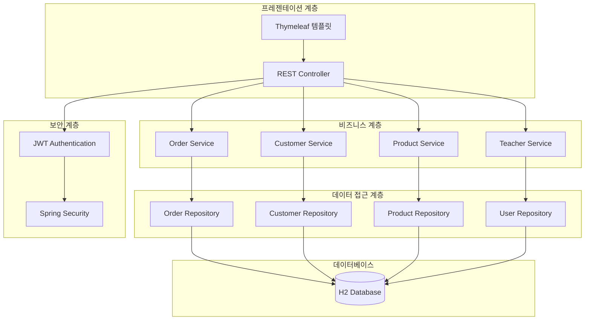
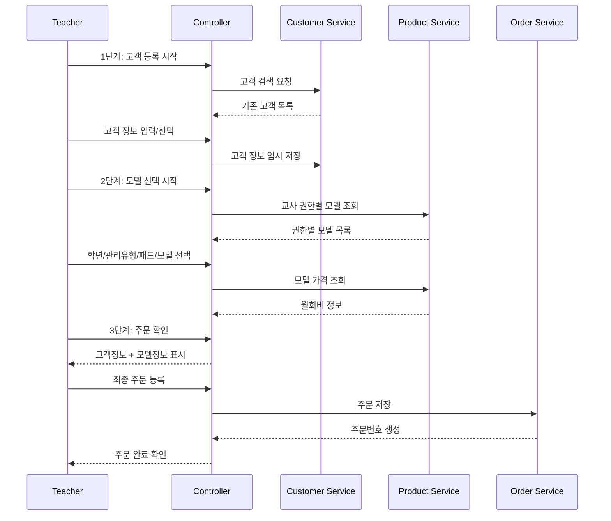

# 설계 문서

## 개요

교사 주문 등록 시스템은 기존의 Spring Boot 기반 로그인 시스템을 확장하여 교사들이 3단계 프로세스를 통해 고객 정보를 등록하고 모델을 선택하여 주문을 등록할 수 있는 웹 애플리케이션입니다. 시스템은 교사의 권한에 따라 판매 가능한 모델을 구분하고, 안전한 주문 관리 기능을 제공합니다.

## 아키텍처

### 전체 시스템 아키텍처



### 3단계 주문 프로세스 플로우



## 컴포넌트 및 인터페이스

### 1. 컨트롤러 계층

#### OrderController
- **역할**: 주문 관련 HTTP 요청 처리
- **주요 메서드**:
  - `GET /order/step1`: 고객 등록 페이지
  - `POST /order/step1`: 고객 정보 임시 저장
  - `GET /order/step2`: 모델 선택 페이지
  - `POST /order/step2`: 모델 선택 정보 저장
  - `GET /order/step3`: 주문 확인 페이지
  - `POST /order/step3`: 최종 주문 등록
  - `GET /order/list`: 주문 목록 조회
  - `GET /order/{id}`: 주문 상세 조회

#### CustomerController
- **역할**: 고객 검색 및 관리
- **주요 메서드**:
  - `GET /customer/search`: 고객 검색 팝업
  - `POST /customer/search`: 고객 검색 실행

### 2. 서비스 계층

#### OrderService
- **역할**: 주문 비즈니스 로직 처리
- **주요 메서드**:
  - `saveTemporaryOrder()`: 임시 주문 정보 저장
  - `createOrder()`: 최종 주문 생성
  - `getOrdersByTeacher()`: 교사별 주문 목록 조회
  - `getOrderDetail()`: 주문 상세 정보 조회
  - `calculateTotalAmount()`: 총액 계산

#### CustomerService
- **역할**: 고객 정보 관리
- **주요 메서드**:
  - `searchCustomers()`: 고객 검색
  - `saveCustomer()`: 고객 정보 저장
  - `getCustomerById()`: 고객 정보 조회

#### ProductService
- **역할**: 상품/모델 관리
- **주요 메서드**:
  - `getGradeOptions()`: 학년 옵션 조회
  - `getManagementTypes()`: 관리/비관리 옵션 조회
  - `getPadTypesByTeacher()`: 교사별 접근 가능한 패드 종류 조회
  - `getModelsByPadType()`: 패드 종류별 모델 조회
  - `getModelPrice()`: 모델 가격 조회
  - `isProductAccessible()`: 교사의 상품 접근 권한 확인
  - `filterProductsByTeacherAuth()`: 교사 권한에 따른 상품 필터링

### 3. 데이터 접근 계층

#### Repository 인터페이스들
- `OrderRepository`: 주문 데이터 CRUD
- `CustomerRepository`: 고객 데이터 CRUD  
- `ProductRepository`: 상품 데이터 CRUD
- `UserRepository`: 사용자(교사) 데이터 CRUD (기존)

## 권한 관리 시스템

### 교사 권한 분류
기존 User 엔티티의 속성들을 활용하여 교사의 상품 접근 권한을 결정합니다:

#### 높은 권한 (Premium Access)
- **CntrTyCd**: CHRG, PRLSN
- **부서코드**: 1501, 1502, 1505, 1601, 1602
- **접근 가능**: 모든 상품 (일반 + 제한 상품)

#### 중간 권한 (Advanced Access)  
- **CntrTyCd**: CNSTN
- **부서코드**: 1500, 1503, 1504, 1600
- **접근 가능**: 일반 상품 + 일부 제한 상품

#### 기본 권한 (Basic Access)
- **CntrTyCd**: SPRT, UNTY
- **부서코드**: 1506
- **TeacType**: C (Center Director)
- **접근 가능**: 일반 상품만

### 상품 접근 제어 로직
```java
public boolean isProductAccessible(User teacher, Product product) {
    // 제한이 없는 상품은 모든 교사가 접근 가능
    if (!product.isRestrictedAccess()) {
        return true;
    }
    
    // 제한된 상품의 경우 allowedTeacherTypes 확인
    String allowedTypes = product.getAllowedTeacherTypes();
    if (allowedTypes == null || allowedTypes.isEmpty()) {
        return false;
    }
    
    // 교사의 CntrTyCd 또는 TeacType이 허용 목록에 있는지 확인
    CntrTyCd cntrTyCd = teacher.getCntrTyCd();
    TeacType teacType = teacher.getTeacType();
    
    return allowedTypes.contains(cntrTyCd.name()) || 
           allowedTypes.contains(teacType.name());
}
```

## 데이터 모델

### 1. Customer (고객)
```java
@Entity
public class Customer {
    @Id
    @GeneratedValue
    private Long id;
    
    // 부모 정보
    private String parentName;
    private String parentPhone;
    private String parentEmail;
    private String address;
    
    // 자녀 정보
    private String childName;
    private String childGrade;
    private String school;
    
    private LocalDateTime createdAt;
    private LocalDateTime updatedAt;
}
```

### 2. Product (상품/모델)
```java
@Entity
public class Product {
    @Id
    @GeneratedValue
    private Long id;
    
    private String grade;           // 학년
    private String managementType;  // 관리/비관리
    private String padType;         // 패드 종류
    private String modelName;       // 모델명
    private BigDecimal monthlyFee;  // 월회비
    
    private boolean active;         // 활성화 여부
    
    // 권한 제한이 있는 상품인지 여부
    private boolean restrictedAccess;
    
    // 제한된 상품에 접근 가능한 교사 유형들 (JSON 형태로 저장)
    private String allowedTeacherTypes; // 예: "CHRG,PRLSN" 또는 "T,M"
}
```

### 3. Order (주문)
```java
@Entity
public class Order {
    @Id
    @GeneratedValue
    private Long id;
    
    private String orderNumber;     // 주문번호
    
    @ManyToOne
    private User teacher;           // 주문 등록 교사
    
    @ManyToOne
    private Customer customer;      // 고객
    
    @ManyToOne
    private Product product;        // 선택된 상품
    
    private Integer quantity;       // 수량
    private BigDecimal totalAmount; // 총액
    
    @Enumerated(EnumType.STRING)
    private OrderStatus status;     // 주문 상태
    
    private LocalDateTime createdAt;
    private LocalDateTime updatedAt;
}
```

### 4. OrderSession (주문 세션)
```java
@Entity
public class OrderSession {
    @Id
    private String sessionId;
    
    private String teacherEmpNo;
    
    // 1단계 정보
    @Embedded
    private CustomerInfo customerInfo;
    
    // 2단계 정보
    private String selectedGrade;
    private String selectedManagementType;
    private String selectedPadType;
    private Long selectedProductId;
    private Integer quantity;
    
    private LocalDateTime createdAt;
    private LocalDateTime expiresAt;
}
```

### 5. 기존 User 엔티티 활용
```java
// 기존 User 엔티티의 속성들을 직접 활용
// - TeacType: 교사 유형 (T: Teacher, M: Manager, C: Center Director)
// - CntrTyCd: 센터 유형 코드 (CHRG, PRLSN, CNSTN, SPRT, UNTY)
// - deptCode: 부서 코드 (1500, 1501, 1502, 1503, 1504, 1505, 1506, 1600, 1601, 1602)

// 권한 확인은 서비스 레이어에서 처리:
// - 높은 권한: CHRG, PRLSN (부서코드: 1501, 1502, 1505, 1601, 1602)
// - 중간 권한: CNSTN (부서코드: 1500, 1503, 1504, 1600)
// - 기본 권한: SPRT, UNTY (부서코드: 1506, TeacType.C)
```

## 에러 처리

### 1. 예외 클래스 정의
```java
public class OrderException extends RuntimeException {
    public OrderException(String message) {
        super(message);
    }
}

public class CustomerNotFoundException extends OrderException {
    public CustomerNotFoundException(String message) {
        super(message);
    }
}

public class UnauthorizedProductAccessException extends OrderException {
    public UnauthorizedProductAccessException(String message) {
        super(message);
    }
}
```

### 2. 글로벌 예외 처리
```java
@ControllerAdvice
public class OrderExceptionHandler {
    
    @ExceptionHandler(CustomerNotFoundException.class)
    public String handleCustomerNotFound(Model model, CustomerNotFoundException e) {
        model.addAttribute("error", e.getMessage());
        return "error/customer-not-found";
    }
    
    @ExceptionHandler(UnauthorizedProductAccessException.class)
    public String handleUnauthorizedAccess(Model model, UnauthorizedProductAccessException e) {
        model.addAttribute("error", e.getMessage());
        return "error/unauthorized-access";
    }
}
```

## 테스팅 전략

### 1. 단위 테스트
- **Service 계층**: 비즈니스 로직 검증
  - OrderService의 주문 생성 로직
  - ProductService의 교사별 상품 접근 권한 확인 로직
  - ProductService의 TeacType/CntrTyCd 기반 상품 필터링
  - CustomerService의 고객 검색 로직

### 2. 통합 테스트
- **Repository 계층**: 데이터베이스 연동 테스트
- **Controller 계층**: HTTP 요청/응답 테스트
- **보안**: JWT 인증 및 권한 검사 테스트

### 3. E2E 테스트
- **3단계 주문 프로세스**: 전체 주문 등록 플로우
- **권한별 접근 제어**: 교사 권한에 따른 상품 접근
- **세션 관리**: 단계별 데이터 유지 및 만료

### 4. 테스트 데이터
```java
@TestConfiguration
public class TestDataConfig {
    
    @Bean
    @Primary
    public DataLoader testDataLoader() {
        return new DataLoader() {
            @Override
            public void loadTestData() {
                // 테스트용 교사 데이터
                // 테스트용 상품 데이터
                // 테스트용 고객 데이터
            }
        };
    }
}
```

## 보안 고려사항

### 1. 인증 및 권한
- **JWT 기반 인증**: 기존 시스템 활용
- **교사별 권한 검사**: TeacType, CntrTyCd, deptCode 기반 상품 접근 권한 확인
- **세션 보안**: 주문 세션 데이터 암호화

### 2. 데이터 보호
- **개인정보 보호**: 고객 정보 암호화 저장
- **접근 로그**: 민감한 데이터 접근 기록
- **데이터 유효성 검사**: 입력 데이터 검증

### 3. API 보안
- **CSRF 보호**: Spring Security CSRF 토큰
- **XSS 방지**: 입력 데이터 이스케이프 처리
- **SQL 인젝션 방지**: JPA 파라미터 바인딩

## 성능 최적화

### 1. 데이터베이스 최적화
- **인덱스 설정**: 자주 조회되는 컬럼에 인덱스
- **쿼리 최적화**: N+1 문제 해결을 위한 페치 조인
- **커넥션 풀**: HikariCP 설정 최적화

### 2. 캐싱 전략
- **상품 정보 캐싱**: 자주 조회되는 상품 데이터
- **교사 권한 정보 캐싱**: TeacType, CntrTyCd 기반 권한 정보
- **세션 캐싱**: Redis 또는 메모리 기반 세션 저장

### 3. 프론트엔드 최적화
- **Ajax 비동기 처리**: 단계별 데이터 로딩
- **클라이언트 사이드 검증**: 서버 요청 최소화
- **페이지네이션**: 대량 데이터 조회 시 성능 향상